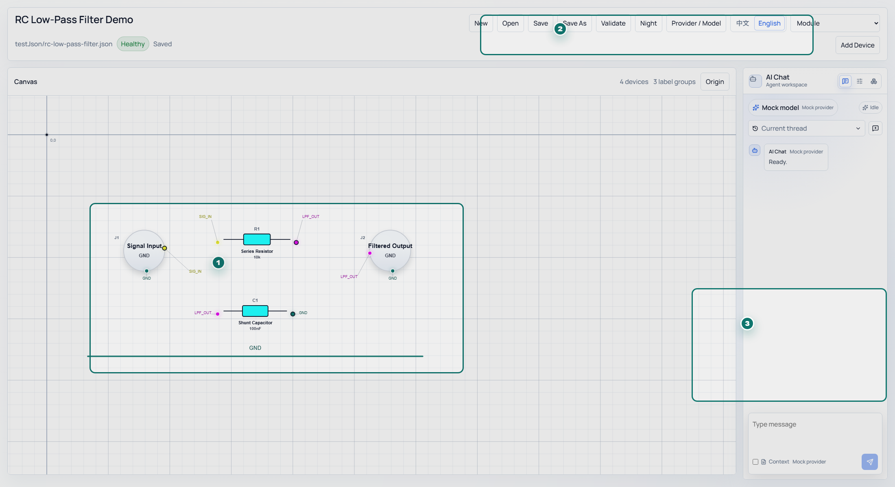
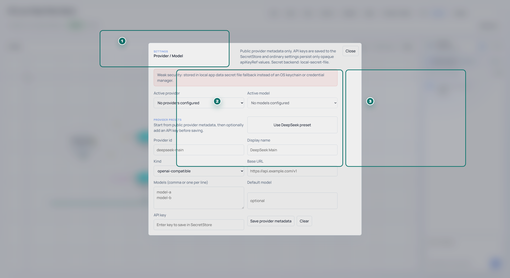
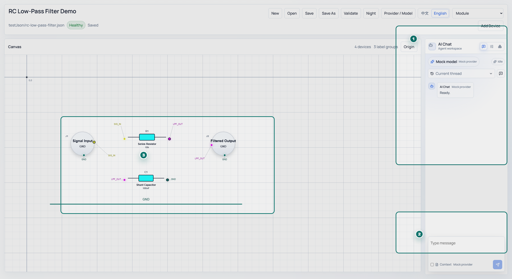
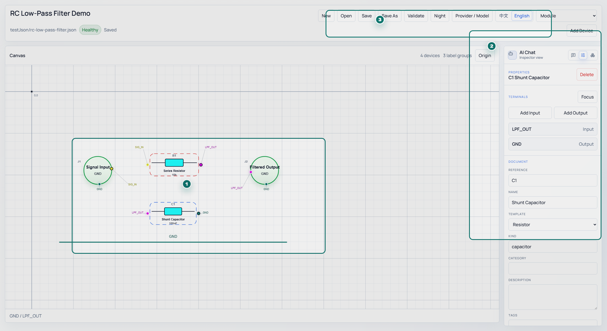
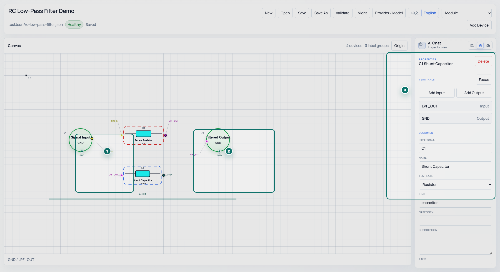
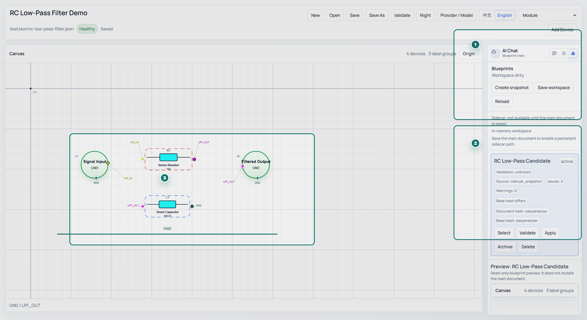
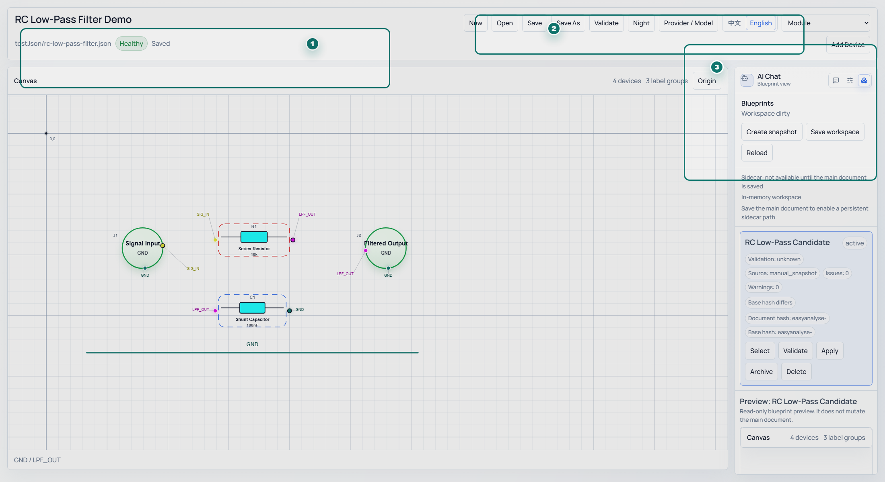
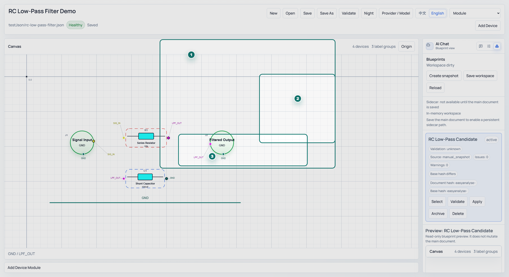
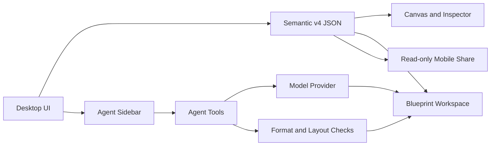

# EASYAnalyse User Guide

[中文](README.zh-CN.md) | [Project Home](README.md)

[](https://github.com/Caltsic/EasyAnalyse/actions/workflows/ci.yml)
[](https://github.com/Caltsic/EasyAnalyse/releases/latest)
[](https://github.com/Caltsic/EasyAnalyse/releases)
[](LICENSE)

EASYAnalyse is a desktop workspace for hardware circuit construction, review, and AI-assisted analysis. It is not a PCB layout tool or a SPICE simulator. Its core goal is to store circuit intent, devices, terminals, network labels, parameters, and layout as semantic JSON that humans, the app, and AI agents can all read and validate.

> Agent, blueprint, and strict circuit-review features are moving quickly. This guide follows the latest local desktop build used for screenshots. Stable and preview builds are marked on the Release page.


## Contents

- [Install](#install)
- [Quick Start](#quick-start)
- [Configure an AI Provider](#configure-an-ai-provider)
- [Generate a Blueprint with the Agent](#generate-a-blueprint-with-the-agent)
- [Build Circuits Manually](#build-circuits-manually)
- [Terminals and Connectivity](#terminals-and-connectivity)
- [Blueprint Workspace](#blueprint-workspace)
- [Validation and Issues](#validation-and-issues)
- [Read-only Mobile Sharing](#read-only-mobile-sharing)
- [Semantic JSON Format](#semantic-json-format)
- [Development Environment](#development-environment)
- [Architecture](#architecture)
- [Example Files](#example-files)
- [FAQ](#faq)
- [Contributor Entry Points](#contributor-entry-points)

## Install

1. Open [GitHub Releases](https://github.com/Caltsic/EasyAnalyse/releases/latest).
2. Download the Windows installer named `EASYAnalyse.Desktop_<version>_x64-setup.exe`.
3. Run the installer and start EASYAnalyse Desktop.

The Release page shows live download counts for each asset. The `downloads` badge at the top of this README counts all GitHub Release assets.

## Quick Start

1. Start EASYAnalyse, then open an example JSON file or create a blank document.
2. Inspect devices and network labels on the canvas. Connectivity comes from terminal `label` values, not wire geometry.
3. Select a device and use the right-side Inspector to edit names, kinds, parameters, terminals, and network labels.
4. Open the Agent sidebar, configure a Provider, and ask for a circuit such as "generate a 5 kHz low-pass filter".
5. Agent-generated candidates enter the blueprint workspace. Preview and validate a candidate before applying it to the main document.



## Configure an AI Provider

EASYAnalyse supports the DeepSeek preset and custom OpenAI-compatible Providers. Provider settings store only public metadata such as name, Base URL, model list, and default model. API keys are saved in the local SecretStore, while normal settings keep only an opaque reference.

Recommended flow:

1. Open model settings.
2. Choose the DeepSeek preset or add a custom OpenAI-compatible Provider.
3. Fill in the Base URL, model names, and default model.
4. Save the API key. Screenshots and docs should use fake keys only.
5. Choose the model used by the Agent. If strict circuit review is enabled, the reviewer can inherit the main model or use a separate Provider/model.

`Context` means the current circuit JSON is sent to the model with your message. Enable it when asking the Agent to inspect, explain, or modify the current circuit. Leave it disabled for general questions or from-scratch design requests.



## Generate a Blueprint with the Agent

The Agent sidebar is a normal chat surface first. Tool use is available when the model needs to read the current document, generate a filter blueprint, check blueprint format, inspect layout overlap, or request a stricter circuit-correctness review.

Recommended flow:

1. Describe the design goal, for example "make a high-Q low-pass filter with a 5 kHz cutoff".
2. Enable `Context` if the new design should be based on the current canvas.
3. Wait for the model response. Tool calls are collapsed by default and can be expanded when debugging Provider or blueprint problems.
4. Generated blueprints are stored in the blueprint workspace; they do not overwrite the main canvas automatically.
5. Preview the candidate and review validation and diff summaries.
6. Apply the candidate when it matches the intended design.



## Build Circuits Manually

Manual editing is useful when refining AI candidates, cleaning up layout, or creating a semantic circuit from scratch:

- Choose a device template from the top toolbar and place a module on the canvas.
- Drag modules to adjust layout; multi-select can move devices together.
- Select a module and edit `name`, `kind`, `reference`, package, and electrical parameters in the Inspector.
- Add or adjust terminals, then set direction, side, order, and pin name.
- Give terminals the same `label` to express connectivity.



## Terminals and Connectivity

EASYAnalyse uses terminal `label` values as the source of connectivity truth:

- If an MCU `SCL` terminal and a sensor `SCL` terminal both use `I2C_SCL`, they are part of the same network.
- If a regulator output and IC power pins use `3V3`, they are part of the 3.3 V power network.
- A terminal without a label is treated as unconnected or semantically incomplete.

Network lines on the canvas are visual aids for readability. They do not create connectivity and do not replace terminal labels. Agent-generated JSON follows the same rule: do not add legacy `wires`, `nodes`, `junctions`, or `signalId` fields.



## Blueprint Workspace

Blueprints are candidate circuits or history snapshots. They protect the main document from being overwritten by AI output or experimental edits. You can:

- Create a snapshot of the current document.
- View multiple Agent-generated candidates.
- Preview a candidate circuit.
- Re-run validation.
- Compare the candidate against the current main document.
- Apply, archive, or delete candidates.

If an Agent run completes but the main canvas does not change, open the blueprint workspace first. Candidates are stored there until you apply one.



## Validation and Issues

Validation has two categories:

- **Hard format checks**: missing required fields, wrong field types, unknown fields, or format problems that can prevent a device from rendering. These usually must be fixed.
- **Semantic hints**: missing parameters, unconnected terminals, unclear power labels, suspicious directions, or layout text overlap. These are engineering review signals, not automatic proof that the circuit is wrong.

Agent tools return detailed errors back to the model. The more concrete a format error is, the easier it is for the model to repair. Semantic hints should be judged against the user request and engineering intent.



## Read-only Mobile Sharing

The desktop app can create a local-network read-only link and QR code for the current circuit snapshot. Mobile viewing is useful for review and presentation. It does not sync later edits and cannot modify the desktop document.



## Semantic JSON Format

Minimal semantic v4 document:

```json
{
  "schemaVersion": "4.0.0",
  "document": {
    "id": "rc-low-pass-demo",
    "title": "RC Low-Pass Demo"
  },
  "devices": [
    {
      "id": "r1",
      "name": "R1",
      "kind": "resistor",
      "properties": { "value": "3.3k" },
      "terminals": [
        { "id": "r1-a", "name": "A", "direction": "input", "label": "VIN" },
        { "id": "r1-b", "name": "B", "direction": "output", "label": "VOUT" }
      ]
    },
    {
      "id": "c1",
      "name": "C1",
      "kind": "capacitor",
      "properties": { "value": "10nF" },
      "terminals": [
        { "id": "c1-a", "name": "A", "direction": "input", "label": "VOUT" },
        { "id": "c1-b", "name": "B", "direction": "output", "label": "GND" }
      ]
    }
  ],
  "view": {
    "canvas": { "units": "px", "grid": { "enabled": true, "size": 16 } },
    "devices": {
      "r1": { "position": { "x": 160, "y": 160 } },
      "c1": { "position": { "x": 360, "y": 160 } }
    },
    "networkLines": {}
  }
}
```

Key rules:

- Required top-level fields are `schemaVersion`, `document`, `devices`, and `view`.
- Every device needs `id`, `name`, `kind`, and `terminals`.
- Every terminal needs `id`, `name`, and `direction`, and usually needs `label`.
- Connectivity is expressed only by equal `terminal.label` values.
- `view.networkLines` improves readability but does not create connectivity.

## Development Environment

The desktop app uses Vite, React, TypeScript, Tauri, and Rust.

```powershell
cd easyanalyse-desktop
npm install
npm run dev
```

Common commands:

```powershell
npm run typecheck
npm run lint
npm test
npm run verify
npm run tauri:build
```

Before releasing, follow the [Release Policy](docs/governance/release-policy.md). Normal development goes into `main` through short-lived branches and pull requests.

## Architecture



## Example Files

- [RC low-pass filter](testJson/rc-low-pass-filter.json)
- [Semantic v4 demo](testJson/semantic-v4-demo.json)
- [STM32F103C8T6 minimum system](testJson/stm32f103c8t6-minimum-system.json)
- [4th-order Butterworth low-pass filter](testJson/butterworth-4th-order-lowpass.json)

## FAQ

**Why did the Agent finish without changing the main canvas?**
Generated circuits are stored in the blueprint workspace. Preview a candidate and apply it manually.

**Do validation warnings always need to be fixed?**
No. Hard format errors usually must be fixed. Semantic warnings are review hints.

**Can EASYAnalyse replace PCB or SPICE tools?**
No. EASYAnalyse focuses on semantic circuit expression, AI collaboration, and structure review. It does not replace PCB layout, SPICE simulation, component databases, or production DRC/ERC.

**What does Context send?**
When `Context` is enabled, the current circuit JSON is sent to the selected model Provider with your message. Check the Provider data policy before sending private hardware designs.

## Contributor Entry Points

- [Report a bug](https://github.com/Caltsic/EasyAnalyse/issues/new?template=bug_report.yml): include reproduction steps, environment, version, and screenshots.
- [Request a feature](https://github.com/Caltsic/EasyAnalyse/issues/new?template=feature_request.yml): discuss feasibility and scope first.
- [Start a discussion](https://github.com/Caltsic/EasyAnalyse/issues/new?template=discussion.yml): use this for architecture, interaction, and format design.
- [Contributing](CONTRIBUTING.md): branch, commit, PR, and review rules.
- [Labels](.github/labels.yml): `bug`, `feature`, `discussion`, `docs`, `agent`, `desktop`, `mobile`, and more.

[中文](README.zh-CN.md) | [Project Home](README.md)
