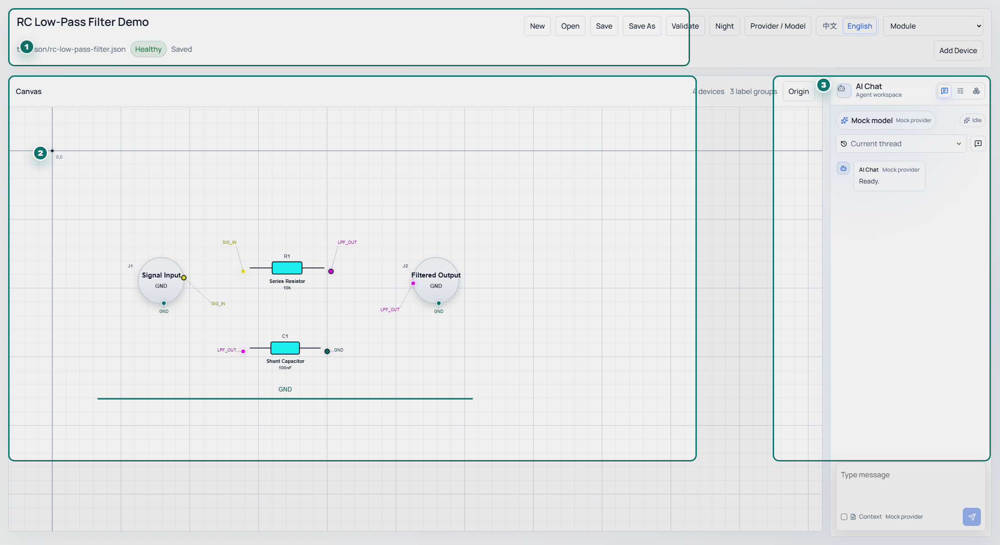

# EASYAnalyse

[中文](README.zh-CN.md) | [English](README.en-US.md)

EASYAnalyse is a desktop workspace for building, reviewing, and discussing hardware circuits with AI. It stores circuit intent as semantic JSON: devices, terminals, network labels, parameters, validation results, and canvas layout are all readable by humans, the app, and large language model agents.

EASYAnalyse 是一款面向硬件电路搭建、审阅与 AI 协作的桌面软件。它使用语义 JSON 表达电路：器件、端子、网络标签、参数、校验结果和画布布局都可以被人、软件和大模型 Agent 共同理解。

## Start Here

| I want to... | Go to |
| --- | --- |
| Install and use EASYAnalyse | [English User Guide](README.en-US.md) / [中文用户指南](README.zh-CN.md) |
| Download the latest installer | [GitHub Releases](https://github.com/Caltsic/EasyAnalyse/releases/latest) |
| Configure an AI Provider | [Agent and Provider guide](README.en-US.md#configure-an-ai-provider) / [Agent 与 Provider](README.zh-CN.md#配置-ai-provider) |
| Generate and apply a circuit blueprint | [Blueprint workflow](README.en-US.md#generate-a-blueprint-with-the-agent) / [蓝图生成流程](README.zh-CN.md#使用-agent-生成并应用蓝图) |
| Understand the JSON format | [Semantic JSON](README.en-US.md#semantic-json-format) / [语义-json-格式](README.zh-CN.md#语义-json-格式) |
| Report a bug or propose a feature | [Issues](https://github.com/Caltsic/EasyAnalyse/issues/new/choose) |
| Contribute code or docs | [Contributing](CONTRIBUTING.md) |

## What EASYAnalyse Does

- Build semantic circuit diagrams for power supplies, MCUs, filters, op-amp stages, connectors, drivers, sensors, and mixed analog/digital modules.
- Use the Agent sidebar as a normal chat surface first, then let the model call tools when it needs to read the current document, generate blueprints, validate JSON, or review candidate circuits.
- Keep AI-generated circuit candidates in the blueprint workspace before applying them to the main canvas.
- Validate whether JSON can be opened and rendered; treat semantic issues as engineering review hints rather than automatic blockers.
- Share a read-only mobile snapshot on the local network.

## Documentation Map

- [中文用户指南](README.zh-CN.md)
- [English User Guide](README.en-US.md)
- [Contributing / 贡献指南](CONTRIBUTING.md)
- [Security Policy](SECURITY.md)
- [Code of Conduct](CODE_OF_CONDUCT.md)
- [Release Policy](docs/governance/release-policy.md)
- [Branching and Permissions](docs/governance/branching-and-permissions.md)
- [Issue and Commit Policy](docs/governance/issue-and-commit-policy.md)

## License

EASYAnalyse is released under the [MIT License](LICENSE).

[中文](README.zh-CN.md) | [English](README.en-US.md)
