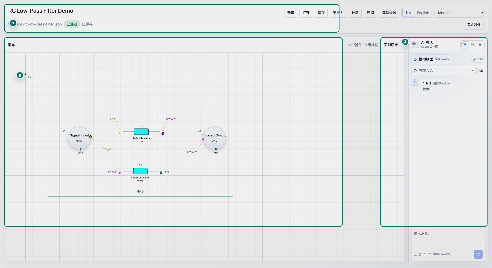
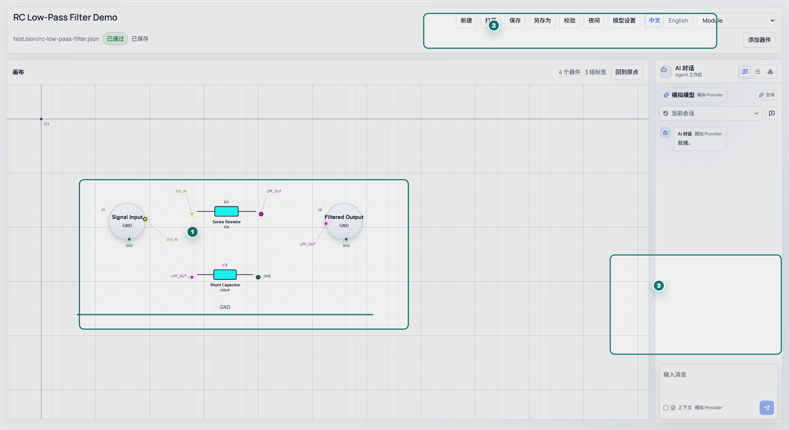
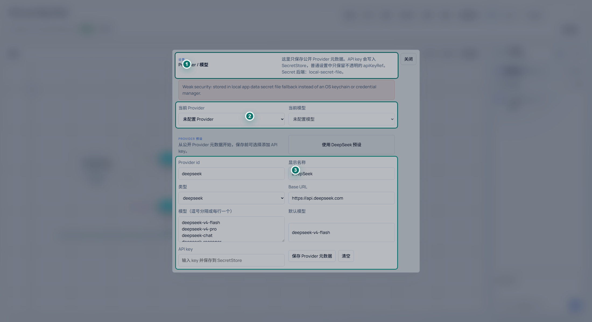
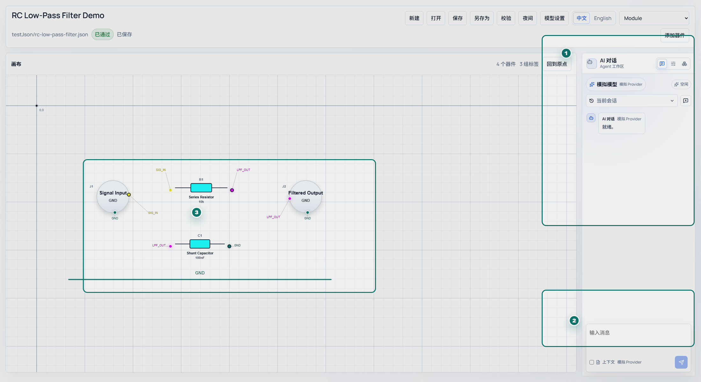
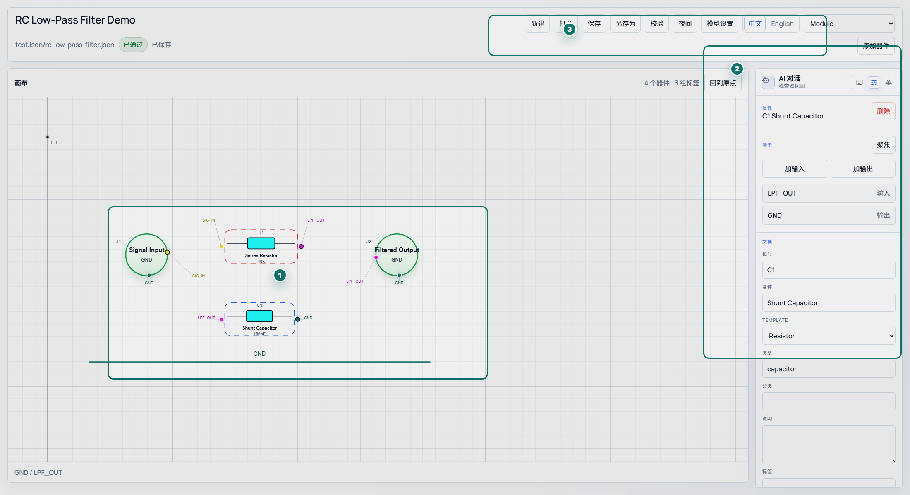
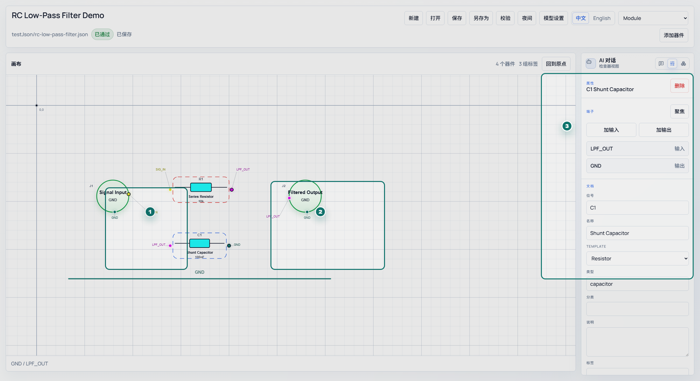
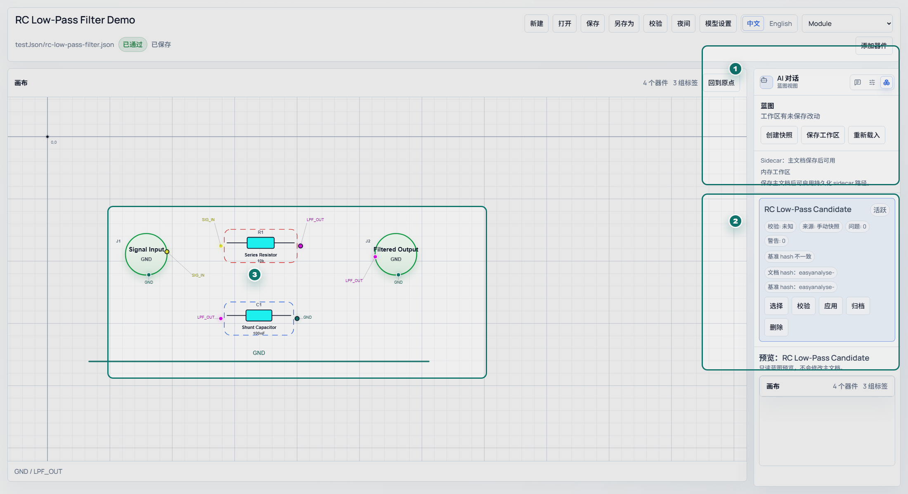
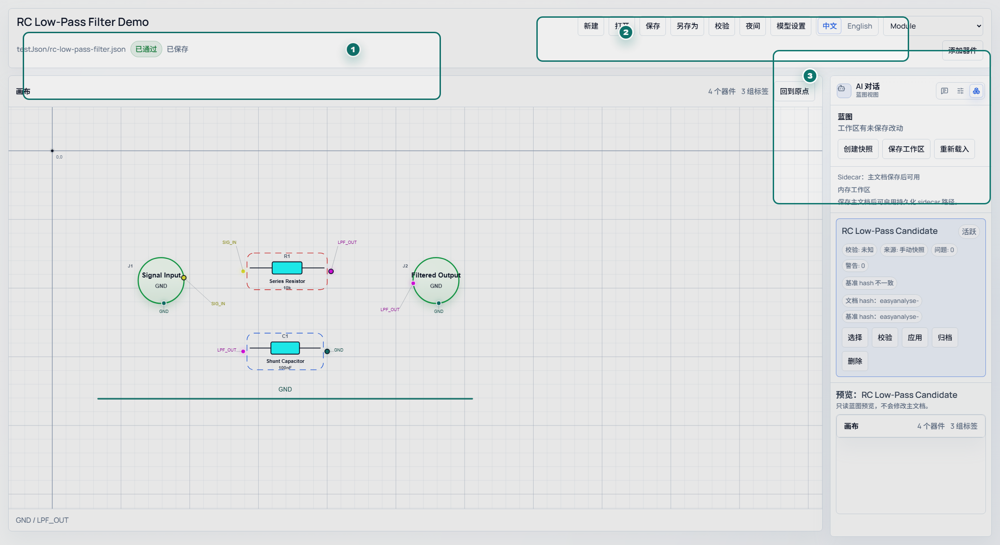
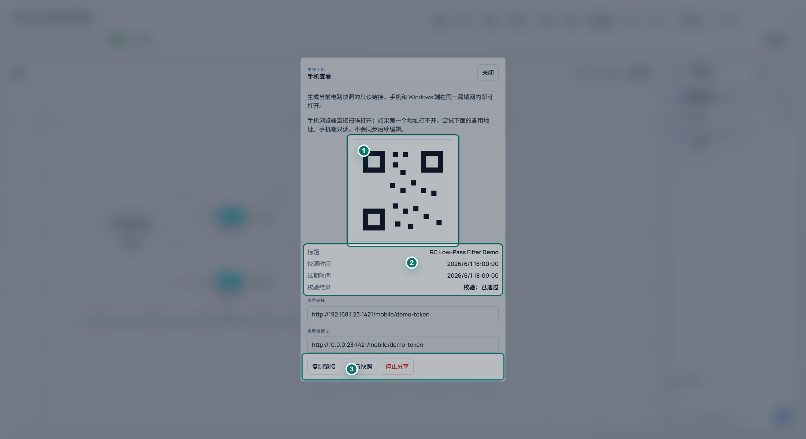
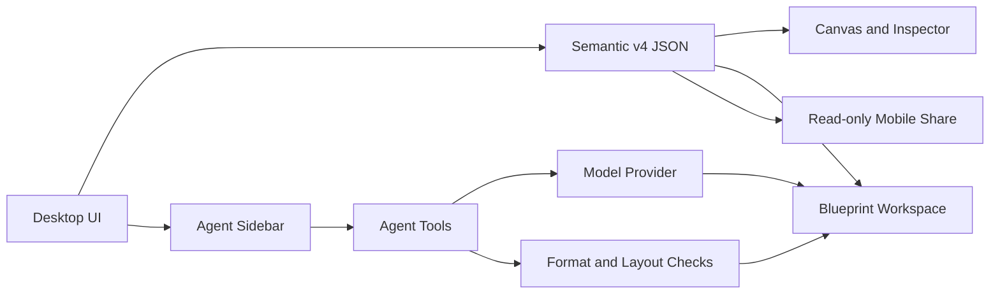

# EASYAnalyse 中文用户指南

[English](README.en-US.md) | [项目首页](README.md)

[](https://github.com/Caltsic/EasyAnalyse/actions/workflows/ci.yml)
[](https://github.com/Caltsic/EasyAnalyse/releases/latest)
[](https://github.com/Caltsic/EasyAnalyse/releases)
[](LICENSE)

EASYAnalyse 是一款面向硬件工程与 AI 协作的电路搭建、审阅和分析软件。它不是 PCB Layout 工具，也不是 SPICE 仿真器；它的核心目标是把电路意图、器件、端子、网络标签、参数和布局保存为可读、可校验、可由 AI 继续理解的语义 JSON。

> Agent、蓝图和严格电路审阅能力仍在快速迭代中。README 按当前本地最新版截图和流程编写，正式 Release 页面会标明稳定版本与预览版本。



图中标注：`1` 文件标题、路径、校验和保存状态；`2` 主画布与坐标网格；`3` 右侧 Agent、Inspector 和蓝图工作区入口。

## 目录

- [安装](#安装)
- [快速开始](#快速开始)
- [配置 AI Provider](#配置-ai-provider)
- [使用 Agent 生成并应用蓝图](#使用-agent-生成并应用蓝图)
- [手动搭建电路](#手动搭建电路)
- [端子线与连接规则](#端子线与连接规则)
- [蓝图工作区](#蓝图工作区)
- [校验与问题提示](#校验与问题提示)
- [移动端只读分享](#移动端只读分享)
- [语义 JSON 格式](#语义-json-格式)
- [开发环境](#开发环境)
- [架构图](#架构图)
- [示例文件](#示例文件)
- [常见问题](#常见问题)
- [贡献入口](#贡献入口)

## 安装

1. 打开 [GitHub Releases](https://github.com/Caltsic/EasyAnalyse/releases/latest)。
2. 下载 Windows 安装包 `EASYAnalyse.Desktop_<version>_x64-setup.exe`。
3. 运行安装包并启动 EASYAnalyse Desktop。

Release 页面会显示每个安装包的实时下载量；README 顶部的 `downloads` 徽章统计所有 GitHub Release 资产的累计下载量。

## 快速开始

1. 启动 EASYAnalyse，打开示例 JSON 或新建空白文档。
2. 在画布中查看器件与网络标签；连接事实来自端子 `label`，不是导线几何形状。
3. 选择一个器件，在右侧 Inspector 中编辑名称、类型、参数、端子和网络标签。
4. 打开 Agent 侧边栏，配置 Provider 后输入需求，例如“生成一个 5 kHz 低通滤波器”。
5. Agent 生成的候选会进入蓝图工作区；先预览和校验，再点击应用。



图中标注：`1` 示例电路和网络标签；`2` 顶部文件、校验、模型设置和器件模板入口；`3` Agent 对话输入区，配置 Provider 后可直接提出设计需求。

## 配置 AI Provider

EASYAnalyse 支持 DeepSeek 预设和 OpenAI-compatible Provider。Provider 设置只保存公开元数据，例如名称、Base URL、模型列表和默认模型；API key 会写入本地 SecretStore，普通设置中只保留不可读的引用。

推荐流程：

1. 打开模型设置。
2. 选择 DeepSeek 预设，或添加自定义 OpenAI-compatible Provider。
3. 填写 Base URL、模型名和默认模型。
4. 保存 API key。截图和文档示例必须使用假 key，不要提交真实密钥。
5. 选择 Agent 使用的模型；如已启用严格电路审阅器，可让审阅模型继承主模型，也可单独选择 Provider 和模型。

`Context` 表示把当前电路 JSON 一起发给模型。检查当前电路、基于已有设计继续修改、解释拓扑时建议勾选；从零问通用问题时可以不勾选。



图中标注：`1` Provider 设置说明和 SecretStore 后端；`2` 当前 Provider 与当前模型选择；`3` Provider 元数据、模型列表和 API key 保存入口。

## 使用 Agent 生成并应用蓝图

Agent 侧边栏首先是正常对话窗口，其次才是在需要时调用工具的硬件开发助手。模型可以自主调用读取当前文档、生成滤波器蓝图、检查蓝图格式、检查布局重叠、严格审阅电路正确性等工具。

一次推荐流程：

1. 在 Agent 输入框描述目标，例如“做一个高品质因数低通滤波器，截止频率 5 kHz”。
2. 如果需要基于当前画布继续设计，勾选 `Context`。
3. 等待模型回复。工具调用记录默认折叠；调试 Provider 或蓝图问题时再展开。
4. 如果模型生成蓝图，候选会存入蓝图工作区，不会直接覆盖主画布。
5. 在蓝图工作区预览候选，查看校验结果和差异摘要。
6. 确认后点击应用，把候选写入当前主文档。



图中标注：`1` Agent 会话、模型和视图切换区；`2` 消息输入、Context 和发送按钮；`3` Agent 生成或参考的候选电路区域。

## 手动搭建电路

手动搭建适合快速修正 AI 候选、整理布局或从零画一个语义电路：

- 从顶部工具栏选择器件模板并放置模块。
- 拖动模块调整位置，多选后可以一起移动。
- 选中模块后在 Inspector 中编辑 `name`、`kind`、`reference`、封装和电气参数。
- 添加或调整端子，设置方向、所在边、顺序和引脚名。
- 为端子填写相同 `label` 来建立连接关系。



图中标注：`1` 画布中的器件、选中状态和端子标签；`2` 右侧 Inspector，用来编辑属性、端子和模板；`3` 顶部工具栏，用来保存、校验、切换模型设置和选择器件模板。

## 端子线与连接规则

EASYAnalyse 的连接真相来自端子 `label`：

- MCU 的 `SCL` 端子和传感器的 `SCL` 端子都写成 `I2C_SCL`，它们属于同一网络。
- 稳压器输出端和芯片供电脚都写成 `3V3`，它们属于 3.3 V 电源网络。
- 未填写 label 的端子会被视为未连接或语义不完整。

画布上的网络线是视觉辅助，用来帮助人阅读布局；它不创建连接，也不替代端子 label。AI 生成电路时也遵守同一规则：不要添加旧式 `wires`、`nodes`、`junctions` 或 `signalId` 字段。



图中标注：`1` 输入侧端子和 `SIG_IN` 标签；`2` 输出侧与地端子标签，例如 `LPF_OUT`、`GND`；`3` Inspector 中的端子列表，连接事实来自这里的 `label`。

## 蓝图工作区

蓝图是候选电路或历史快照，用来保护主文档不被 AI 或实验性修改直接覆盖。你可以：

- 为当前主文档创建快照。
- 查看 Agent 生成的多个候选。
- 预览候选电路。
- 重新校验候选。
- 比较候选与当前主文档的差异。
- 应用、归档或删除候选。

如果 Agent 显示完成但主画布没有变化，请先打开蓝图工作区。候选默认进入蓝图列表，确认后才会应用。



图中标注：`1` 蓝图工作区入口、快照和工作区保存操作；`2` 候选卡片，可选择、校验、应用、归档或删除；`3` 候选预览区域，预览不会直接覆盖主画布。

## 校验与问题提示

校验分为两类：

- **硬格式检查**：缺少必需字段、字段类型错误、未知字段、格式导致器件无法显示。这类问题通常必须修。
- **语义提示**：缺少参数、未连接端子、电源标签不明确、方向可疑、布局文字重叠。这类提示是工程审阅线索，不等于电路一定错误。

Agent 工具会把详细错误返回给模型。格式错误写得越具体，模型越容易自动修复；语义提示则由模型和工程师结合需求判断是否需要修改。



图中标注：`1` 顶部校验状态；`2` 手动触发校验的入口；`3` 蓝图候选中的问题数量和候选校验入口。

## 移动端只读分享

桌面端可以生成当前电路快照的局域网只读链接和二维码，供手机浏览器或 Android 查看器打开。移动端适合审阅和展示，不会同步后续编辑，也不会修改桌面端文档。



图中标注：`1` 手机浏览器可扫描的二维码；`2` 快照标题、生成时间、过期时间和校验状态；`3` 复制链接、刷新快照和停止分享操作。

## 语义 JSON 格式

最小语义 v4 文档示例：

```json
{
  "schemaVersion": "4.0.0",
  "document": {
    "id": "rc-low-pass-demo",
    "title": "RC Low-Pass Demo"
  },
  "devices": [
    {
      "id": "r1",
      "name": "R1",
      "kind": "resistor",
      "properties": { "value": "3.3k" },
      "terminals": [
        { "id": "r1-a", "name": "A", "direction": "input", "label": "VIN" },
        { "id": "r1-b", "name": "B", "direction": "output", "label": "VOUT" }
      ]
    },
    {
      "id": "c1",
      "name": "C1",
      "kind": "capacitor",
      "properties": { "value": "10nF" },
      "terminals": [
        { "id": "c1-a", "name": "A", "direction": "input", "label": "VOUT" },
        { "id": "c1-b", "name": "B", "direction": "output", "label": "GND" }
      ]
    }
  ],
  "view": {
    "canvas": { "units": "px", "grid": { "enabled": true, "size": 16 } },
    "devices": {
      "r1": { "position": { "x": 160, "y": 160 } },
      "c1": { "position": { "x": 360, "y": 160 } }
    },
    "networkLines": {}
  }
}
```

关键点：

- 顶层必需字段是 `schemaVersion`、`document`、`devices`、`view`。
- 每个器件必须有 `id`、`name`、`kind`、`terminals`。
- 每个端子必须有 `id`、`name`、`direction`，通常还应有 `label`。
- 连接只由相同 `terminal.label` 表示。
- `view.networkLines` 只负责可读性，不创建连接。

## 开发环境

桌面端基于 Vite、React、TypeScript、Tauri 和 Rust。

```powershell
cd easyanalyse-desktop
npm install
npm run dev
```

常用命令：

```powershell
npm run typecheck
npm run lint
npm test
npm run verify
npm run tauri:build
```

发布前请参考 [Release Policy](docs/governance/release-policy.md)。普通开发通过短分支和 PR 进入 `main`，不要直接推送主干。

## 架构图



## 示例文件

- [RC 低通滤波器](testJson/rc-low-pass-filter.json)
- [语义 v4 演示](testJson/semantic-v4-demo.json)
- [STM32F103C8T6 最小系统](testJson/stm32f103c8t6-minimum-system.json)
- [4 阶 Butterworth 低通滤波器](testJson/butterworth-4th-order-lowpass.json)

## 常见问题

**为什么 Agent 完成后主画布没有变化？**
生成结果默认进入蓝图工作区。先预览候选，再应用到主文档。

**校验有 warning 是否一定要修改？**
不一定。硬格式错误通常必须修；语义 warning 是工程审阅提示。

**EASYAnalyse 可以替代 PCB 或 SPICE 吗？**
不能。它关注电路语义表达、AI 协作和结构审阅，不替代 PCB Layout、SPICE 仿真、器件选型数据库或生产级 DRC/ERC。

**Context 会发送什么？**
勾选 `Context` 后，当前电路 JSON 会随用户消息发送给模型 Provider。涉及未公开硬件设计时，请确认 Provider 的数据策略。

## 贡献入口

- [提交 bug](https://github.com/Caltsic/EasyAnalyse/issues/new?template=bug_report.yml)：请包含复现步骤、环境、版本和截图。
- [提出需求](https://github.com/Caltsic/EasyAnalyse/issues/new?template=feature_request.yml)：先讨论可行性和范围。
- [发起讨论](https://github.com/Caltsic/EasyAnalyse/issues/new?template=discussion.yml)：适合架构、交互和格式设计。
- [贡献指南](CONTRIBUTING.md)：分支、提交、PR 和 review 规则。
- [标签列表](.github/labels.yml)：`bug`、`feature`、`discussion`、`docs`、`agent`、`desktop`、`mobile` 等。

[English](README.en-US.md) | [项目首页](README.md)
